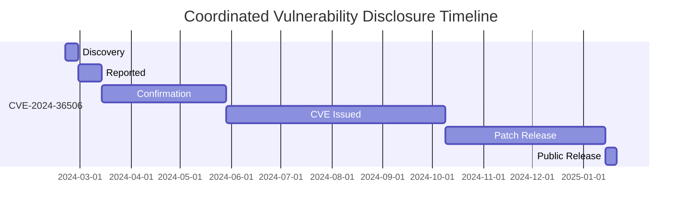

## Details

Vendor:  [Fortinet](https://www.fortinet.com)

Severity:  Low

Impact:  Improper Access Control

CVSSv3 Score:  [3.5](https://nvd.nist.gov/vuln-metrics/cvss/v3-calculator?vector=AV:N/AC:H/PR:N/UI:N/S:U/C:N/I:L/A:N/E:P/RL:X/RC:C&version=3.1)

## Vulnerable Products

| Version | Affected | Solution |
|-------|--------|---------|
| FortiClientEMS Cloud | 7.4	7.4.0 |	Upgrade to 7.4.1 or above |
| FortiClientEMS Cloud | 7.2	7.2.0 through 7.2.4 |	Upgrade to 7.2.5 or above |
| FortiClientEMS Cloud | 7.0	7.0 all versions |	Migrate to a fixed release |
| FortiClientEMS Cloud | 6.4	6.4 all versions |	Migrate to a fixed release |
| FortiClientEMS 7.4 |	7.4.0 |	Upgrade to 7.4.1 or above |
| FortiClientEMS 7.2 |	7.2.0 through 7.2.4 |	Upgrade to 7.2.5 or above |
| FortiClientEMS 7.0 |	7.0 all versions |	Migrate to a fixed release |
| FortiClientEMS 6.4 |	6.4 all versions |	Migrate to a fixed release |

## Summary

An improper verification of source of a communication channel vulnerability (CWE-940) in FortiClientEMS may allow a remote attacker to bypass the trusted host feature via session connection.

## Disclosure Timeline

## References

[Fortiguard PSIRT:  FG-IR-24-078](https://www.fortiguard.com/psirt/FG-IR-24-078)

[Mitre: CVE-2024-36506](https://cve.mitre.org/cgi-bin/cvename.cgi?name=CVE-2024-36506)

[Mitre:  CWE-940](https://cwe.mitre.org/data/definitions/940.html)

[NIST Vulnerability Database: CVE-2024-36506](https://nvd.nist.gov/vuln/detail/CVE-2024-36506)

